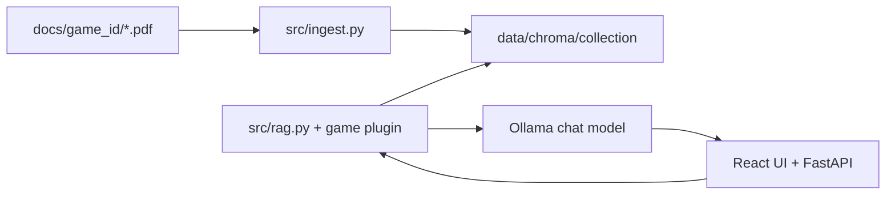

# How rulebook-ai works

Local tabletop rules assistant. You supply PDFs in `docs/`; the app indexes them locally and answers questions with retrieval-augmented generation (RAG) via Ollama.

## Purpose

- **Personal study / at-table helper** — not an official rules arbiter.
- **Fully local** — PDFs, vector index, and LLM calls stay on your machine.
- **Multi-game** — each game has its own Chroma collection and optional game-specific tools (character sheet, shortcuts, curated tables).

## Data flow



1. **Ingest** — PDF text (or OCR for image pages) is cleaned, chunked, embedded with `nomic-embed-text`, and stored in Chroma with metadata (`source_file`, `page`, `faction`, etc.).
2. **Query** — User question is optionally enhanced by the active game plugin, then hybrid retrieval (dense + lexical + RRF) pulls candidate chunks. Optional **cross-encoder rerank** reorders candidates (all games). Game plugins may **boost** results last (prepend pinned chunks).
3. **Answer** — Top chunks plus a system prompt are sent to the chat model; citations come from chunk metadata.

## Modes

| Mode | Behaviour |
|------|-----------|
| **RAG** | Direct retrieval + single LLM call. Faction filters in Settings apply. |
| **Agent** | LangGraph router sends dice/card/Leviathan/shortcut requests to tools first, then RAG when needed. |
| **Slash commands** | `/roll`, `/draw`, `/deck reset` bypass retrieval for instant replies. |

Shared table tools (dice, 52-card deck) live in [`src/play_tools.py`](../src/play_tools.py) and are keyed by `game_id` so each game mode keeps its own deck.

## Game registry

Games are registered in [`src/games/registry.py`](../src/games/registry.py). Each game implements a **GamePlugin** ([`src/games/base.py`](../src/games/base.py)) with:

- **Metadata** — `game_id`, `label`, Chroma `collection`, PDF sources, factions, feature flags (`has_game_state`, `has_character_sheet`)
- **Optional hooks** — query enhancement, faction inference, retrieval boosting, agent routing, chat greeting, UI sidebar rendering

[`src/config.py`](../src/config.py) holds global paths and Ollama settings; per-game PDF lists live in each plugin module.

Current games:

| ID | Label | Extra features |
|----|-------|----------------|
| `40k` | Warhammer 40,000 | Battle game state, Leviathan unit list, codex/datasheet retrieval |
| `brambletrek` | Brambletrek | Gnawborn roster, Lonelog, story/card modes, curated YAML, journey/adventure shortcuts |
| `brambletrek_2` | Brambletrek 2 | Traveller roster, Lonelog, Misty Hollow grid, 16 legacies, exploration/combat shortcuts, curated YAML |
| `sansibilia` | A Visit To San Sibilia | Visit roster, Lonelog, card-oracle journaling, city-change tracker, curated YAML |
| `lighthouse` | The Lighthouse at the Edge of the Universe | Keeper roster, Lonelog, lamp/maintenance/observation/events, beachcombing, curated YAML |
| `apothecaria` | Apothecaria | Witch cottage roster, Lonelog, ailments/reagents/locales, foraging shortcuts, curated YAML |
| `colostle` | Colostle | Adventurer roster, Lonelog, exploration/combat card tables, ocean/city/battlements modules, curated YAML |
| `whispers` | Whispers in the Walls | Investigation roster, Lonelog, Whispers deck builder, suit tables, oracle 2d6, curated YAML |
| `ashes` | Ashes (Mayfalls) | Scion roster, Lonelog, dungeon card draws, trials/Ember, journal prompt sets, curated YAML |
| `outgunned` | Outgunned Adventure | GM solo, Assistant Director tables, mission/hero entity, Lonelog |
| `tor` | The One Ring (Strider Mode) | GM solo, Strider Mode curated tables, patron/journey shortcuts |
| `coriolis` | Coriolis: The Great Dark | GM solo, attribute+gear dice, Explorer/crew/Bird entity, Lonelog |
| `cosmere` | Cosmere RPG | GM solo, plot dice, Stormlight hero entity, Lonelog |
| `mlp` | My Little Pony RPG | GM solo, d20 checks, pony entity, Lonelog |
| `dnd5e` | D&D 5e (2024) | GM solo, freeform or Faerûn campaign, PHB/DMG/MM PDF set, d20 shortcuts, character entity, Lonelog |

## Key files

| Path | Role |
|------|------|
| [`api/main.py`](../api/main.py) | FastAPI app (REST + SSE chat) |
| [`frontend/`](../frontend/) | React dashboard (play mode layout) |
| [`src/config.py`](../src/config.py) | Paths, models, chunk sizes |
| [`src/games/registry.py`](../src/games/registry.py) | Game plugin lookup |
| [`src/ingest.py`](../src/ingest.py) | PDF → Chroma indexing CLI |
| [`src/rag.py`](../src/rag.py) | Generic hybrid retrieval and answer generation |
| [`src/agent.py`](../src/agent.py) | LangGraph tool router |
| [`src/play_tools.py`](../src/play_tools.py) | Dice and deck primitives |
| [`src/tools.py`](../src/tools.py) | Agent-facing tools (RAG search, Leviathan list) |
| [`src/prompts.py`](../src/prompts.py) | Per-game system prompts |
| [`src/games/saves/`](../src/games/saves/) | Generic play roster, session, Lonelog |
| [`data/curated/`](../data/curated/) | YAML reference data (not indexed; used for lookups) |
| [`data/chroma/`](../data/chroma/) | Vector index (gitignored) |
| [`data/eval/`](../data/eval/) | Retrieval regression cases |

## Retrieval profiles

Configured in **Settings** (shared by all games):

- **Fast** — dense-only, smaller candidate pool
- **Balanced** — hybrid retrieval (dense + lexical + RRF), medium pool
- **Quality** — hybrid with larger pool (best recall)
- **Quality+ rerank** — hybrid + local cross-encoder rerank (`cross-encoder/ms-marco-MiniLM-L-6-v2` by default; override with `RERANK_MODEL`)

Pipeline in [`src/rag.py`](../src/rag.py): hybrid → optional rerank ([`src/retrieval_core.py`](../src/retrieval_core.py)) → `GamePlugin.boost_retrieval` → top-k to LLM.

Game plugins may raise `top_k` or inject page-specific nodes (e.g. Brambletrek rulebook tables) **after** rerank.

## Brambletrek session data

Per-game save slots live under `data/saves/{game_id}/{slot_id}/`. Games with a registered **PlayProfile** (`src/games/saves/`) get:

| File | Contents |
|------|----------|
| `entity.json` or game-specific name (e.g. `character.json`) | Slot entity (character sheet, campaign, etc.) |
| `session.json` | Deck, chat, play settings, game-specific `extra` fields |
| `lonelog.md` | [Lonelog](https://lonelog.readthedocs.io/) v1.5 session log — core symbols (`@`, `?`, `d:`, `->`, `=>`), tags, sessions/scenes, add-on blocks |

Register a new game by defining a `PlayProfile` and calling `register_play_profile()` (see `src/games/brambletrek/play.py`).

## Adding a new game

1. Create `src/games/<game_id>/plugin.py` implementing `GamePlugin` (copy an existing plugin as template).
2. Register it in [`src/games/registry.py`](../src/games/registry.py).
3. Add PDFs under `docs/<game_id>/`.
4. Run `python -m src.ingest --game <game_id>`.
5. *(Optional)* Add curated YAML in `data/curated/` and a `scripts/validate_<game>_curated.py` smoke script.
6. *(Optional)* Add `data/eval/<game>_retrieval_regression.json` and run `scripts/eval_retrieval.py`.
7. *(Optional)* For multi-slot play (roster, deck/chat per slot, Lonelog), add `src/games/<game_id>/play.py` with a `PlayProfile` and import it from `registry.py` (see Brambletrek).

You should **not** need to edit `src/rag.py` or `src/agent.py` for a PDF-only game — only the plugin and UI.

## What stays shared

- Ollama chat + embedding models
- Chroma storage layout (`data/chroma/<collection>`)
- Ingest pipeline (chunking, OCR cache)
- Dice/deck tools and slash commands
- Retrieval profiles and eval harness

## Validation (no Ollama required)

```bash
python3 scripts/validate_play_tools.py
python3 scripts/validate_brambletrek_curated.py   # Brambletrek only
python3 scripts/validate_brambletrek_lonelog.py   # roster + Lonelog
python3 scripts/validate_brambletrek_2_curated.py   # Brambletrek 2 tables
python3 scripts/validate_brambletrek_2_lonelog.py   # Brambletrek 2 roster + Lonelog
python3 scripts/validate_sansibilia_curated.py    # San Sibilia tables
python3 scripts/validate_sansibilia_lonelog.py    # San Sibilia roster + Lonelog
python3 scripts/validate_lighthouse_curated.py    # Lighthouse tables
python3 scripts/validate_lighthouse_lonelog.py    # Lighthouse roster + Lonelog
python3 scripts/validate_apothecaria_curated.py    # Apothecaria tables
python3 scripts/validate_apothecaria_lonelog.py    # Apothecaria roster + Lonelog
python3 scripts/validate_whispers_curated.py    # Whispers tables
python3 scripts/validate_whispers_lonelog.py    # Whispers roster + Lonelog
python3 scripts/validate_ashes_curated.py    # Ashes tables
python3 scripts/validate_ashes_lonelog.py    # Ashes roster + Lonelog
python3 scripts/eval_retrieval.py --game 40k
python3 scripts/eval_retrieval.py --game brambletrek
python3 scripts/eval_retrieval.py --game brambletrek_2
python3 scripts/eval_retrieval.py --game sansibilia
python3 scripts/eval_retrieval.py --game lighthouse
python3 scripts/eval_retrieval.py --game apothecaria
python3 scripts/eval_retrieval.py --game ashes
```
